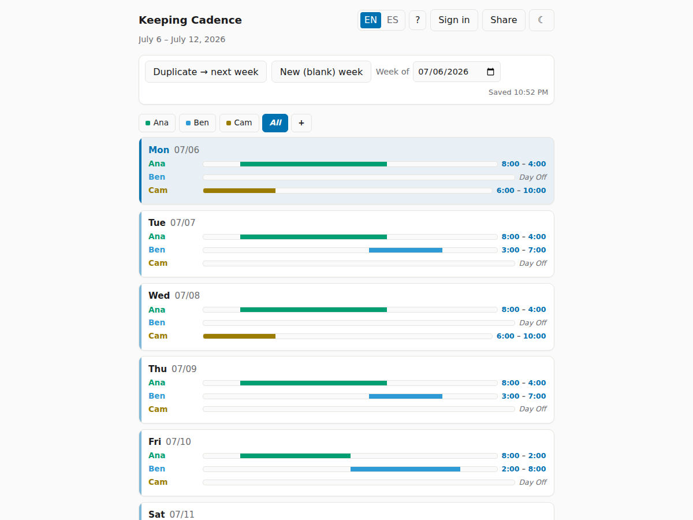
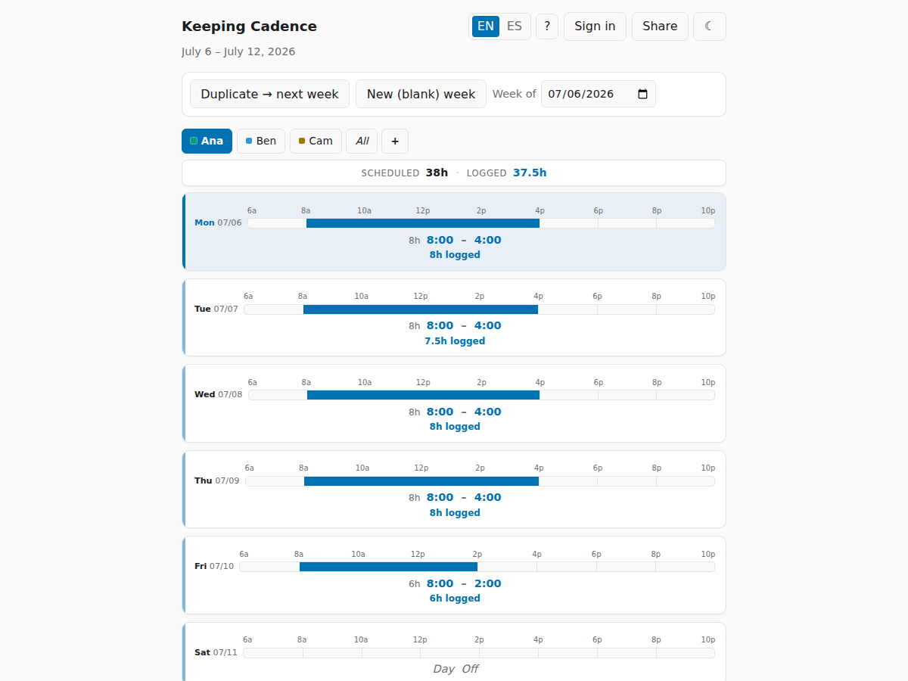
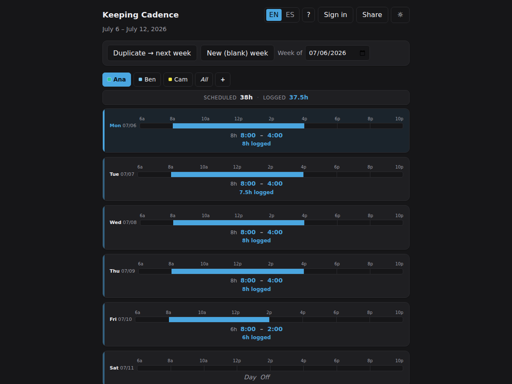
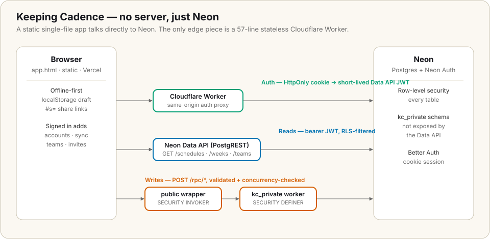

# Keeping Cadence

A weekly schedule app for groups of people. Plot each person's hours on a shared
timeline, log actual hours worked, and share read-only views with anyone.

**Live at: https://app.keepingcadence.com** · marketing site: https://keepingcadence.com



<p align="center">
  
  
</p>

## Architecture at a glance



A multi-tenant SaaS with **no custom server**: the entire backend is Postgres
row-level security + RPC functions on Neon, plus a 57-line Cloudflare Worker that
proxies auth same-origin so the session cookie survives iOS/Safari ITP. See
**[BACKEND.md](BACKEND.md)** for the runbook and **[NEON-REBUILD.md](NEON-REBUILD.md)**
for the two hardest-won debugging lessons.

📝 **Architecture write-up:** [_A multi-tenant SaaS with no server_](https://mattdanusergrant.com/case-studies/keeping-cadence-no-server.html) — the RLS + invoker/definer design and the two cookie/identity bugs that cost the most to find.

## Shape

- **Front-end** — a single self-contained `app.html` (HTML + CSS + vanilla JS,
  no build step). Works fully offline using `localStorage` + URL-hash share
  links. Served as a static page on **Vercel**.
- **Cloud (accounts + teams)** — the browser talks **directly to Neon**: **Neon
  Auth** for login, the **Neon Data API** (PostgREST) for reads, and Postgres
  **RPC functions** for writes, all guarded by **row-level security**. There is
  **no custom server**. Accounts add cross-device sync and a manager/member team
  model (invite people, assign schedules, split plan vs. actual hours). See
  **[BACKEND.md](BACKEND.md)** for setup and **[NEON-REBUILD.md](NEON-REBUILD.md)**
  for the architecture and build status.

Cloud is configured in the `CLOUD` block near the top of `app.html`'s script
(`authBase` + `dataApi`). Signed out, the app stays fully local; anonymous
sharing always uses the client-side `#s=` hash link (no server involved).

## Tests

The load-bearing pure logic — time math, legacy-data migration, day
normalisation, and the `#s=` share-link round-trip — is covered by a
dependency-free smoke test. It reads `app.html`'s inline `<script>`, runs it in a
Node `vm` behind a minimal DOM/localStorage stub, and asserts the pure core:

```bash
node test/smoke.js
```

CI runs it on every push and pull request (`.github/workflows/test.yml`).

The database write-path guards (payload validation, optimistic-concurrency
`stale write` detection, name/length caps) have their own SQL test suite. Against
any Postgres with `schema.sql` applied:

```bash
createdb kctest
psql -d kctest -c 'create role authenticated'
psql -d kctest -f db/schema.sql
psql -d kctest -f db/test.sql   # prints "ALL SQL TESTS PASSED"
```

## License

[MIT](LICENSE).
